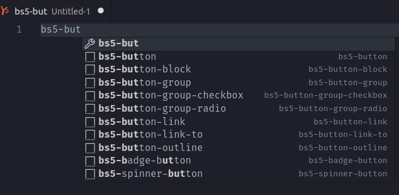

# HAML boostrap 4 & 5 Snippets for VS Code



## How to use

| Version    | Use                       |
| ---------- | ------------------------- |
| Boostrap 4 | bs4-[component]-[variant] |
| Boostrap 5 | bs5-[component]-[variant] |

## Example

Boostrap 5 button

```haml
-# bs5-button

%button.btn.btn-primary{type: 'button'}
  My Button
```

#### Contributing

see [CONTRIBUTING.md](./CONTRIBUTING.md)
